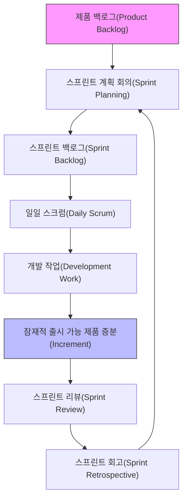
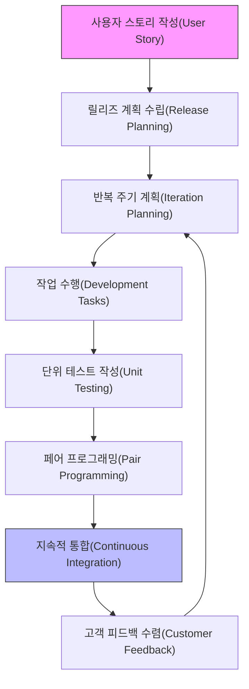

# 1. 소프트웨어 공학
## 1. 상용 소프트웨어
### 특징
- 상업적 목적이나 판매를 목적으로 개발되는 소프트웨어
- 다양한 형태의 라이선스를 이용하여 배포되며 기술 지원을 보증
### 분류 체계
#### 산업 범용 소프트웨어: 시스템 SW, 미들웨어, 응용 SW
#### 산업 특화 소프트웨어: 자동차, 항공, 교육, 물류 등의 산업 전용
## 2. 응용 소프트웨어
### 특징
- 특정 업무를 처리하기 위한 목적으로 작성된 SW
### 분류 체계
#### 기업용
#### 영상 처리
#### CG/VR 
#### 콘텐츠 배포 소프트웨어
#### 자연어 처리
#### 음성처리
...
## 3. 시스템 소프트웨어
### 정의
- 사용자가 손쉽고 효율적으로 컴퓨터 시스템을 사용하도록 돕는 소프트웨어
#### 시스템 정의
- 특정 업무를 수행하기 위해 중앙 처리 장치를 중심으로 구성된 하드웨어 및 소프트웨어의 총칭
> [!note] 입력 -> 처리 -> 출력 -> 제어 -> 피드백
#### 시스템 성능평가 기준
>[!note] 처리능력, 반환 시간, 사용 가능도, 신뢰도
#### 플랫폼
- 특정 시스템을 바탕으로 제공되는 운영체제 및 운영 환경
#### 플랫폼 성능 측정 기준
>[!note] 가용성, 응답 시간, 정확성, 사용률
>
## 4. 소프트웨어 공학
### 최소 비용 개발을 통해 높은 품질의 소프트웨어를 도출하기 위한 모둘 수단과 도구

## 5. 소프트웨어 개발 프레임워크
### 모듈
- 프로그램을 기능별로 분할하여 재사용이 가능하게 끔 부품화한 것
### 라이브러리
- 관련 있는 모듈을 모아놓은 것
### 디자인 패턴
- 특정 기능에 대한 문제해결을 위한 구현 방안에 대한 해결 방식 제시
### 소프트웨어 개발 프레임워크
- 실제적인 개발의 틀을 제공
- 프로그램의 기본 틀을 제공, 개발자가 기능을 구체화
### 소프트웨어 아키텍처
- 다수의 프레임워크를 체계적으로 구성, 설명하는 구조체
### 컴포넌트
- 모듈의 형태로 재사용 가능한 확장된 소프트웨어 블럭
- 인터페이스를 통해 서로에게 접근
### 재 사용 가능한 소프트웨어 요소
- 부분 또는 전체 영역을 모두 재사용 요소로 볼수 있음
### 재사용 방법
- **합성 중심**: 모듈을 조립하여 블록 구성 방식
- **생성 중심**: 추상적인 명세를 구체화하여 완성시키는 패턴 구성 방식
---
# 2. 소프트웨어 개발 수명 주기
### 개발과정을 단계별로 구성한 것
### 폭포수 모델
#### 계획 -> 요구분석 -> 설계 -> 구현 -> 테스트 -> 유지보수
### 프로토타입
- 시제품을 통해 최종 결과물 예측 가능
### 나선형 모델
- 나선을 돌듯 지속적인 개발 과정을 통해 점진적으로 개발하는 것
	#### (반복)계획 및 목표 설정 -> 위험 분석-> 공학적 개발 및 검증 -> 고객 평가
### 애자일 모델
- 고객과의 소통 중심
- 짧은 개발 주기를 반복 고객의 피드백을 소프트웨어에 반영
#### 스크럼(팀을 구성(제품 책임자, 스크럼 마스터, 개발팀) 개발의 효율성을 높이는 개발 모델)
##### 제품 책임자: 목표 제품에 대한 책음일 지고 의사를 결정
##### 스크럼 마스터 : 개발팀원들의 원활한 업무를 위한 가이드 역할
##### 개발팀: 개발에 참여하는 인원(개발자, 디자이너, 테스터)
##### 스프린트: 2~4 주 정도에 하나의 task를 개발
##### 태스트(TASK):  개발 요구사항을 개발자별로 나눈것

#### XP(고객 참여 짧은 개발 과정의 반복을 통한 개발 생산성 증진 모델)
##### 가치: 의사소통, 단순성, 용기, 존중, 피드백

---
| 분류        | 원칙                         | 설명                                            |
| ----------- | ---------------------------- | ----------------------------------------------- |
|             |                              |                                                 |
| 가치(Value) | **의사소통 (Communication)** | 팀 내 협업과 지식 공유를 강조합니다.            |
|             | **단순성 (Simplicity)**      | 지금 필요한 기능만 구현하며 복잡성을 줄입니다.  |
|             | **피드백 (Feedback)**        | 고객 및 테스트 피드백을 빠르게 받아 개선합니다. |
|             | **용기 (Courage)**           | 잘못된 결정을 되돌릴 수 있는 용기와 태도        |
|             | **존중 (Respect)**           | 팀원 간의 신뢰와 존중을 바탕으로 협업           |

# 3. 소프트웨어 개발 방법론
## 1. 소프트웨어 개발 방법론
### 개발 전 과정에 지속적으로 적용할 수 있는 방법, 절차, 기법 등
### 분석 -> 설계 -> 구현 -> 시험

## 2. 방법론 종류
### 구조적 방법론
- 요구사항을 자료 흐름도(DFD)로 표현
- 순차, 선택, 반복의 놀리 구조 구성으로 프로그램의 복잡성을 최소화
- 요구사항 분석 -> 구조적 분석 -> 구조적 설계 -> 구조적 프로그래밍
### 정보 공학 방법론
- 업무 영역 분석을 통해 개념적인 수준의 데이터와 프로세스를 설계
### 객체 지향 방법론
#### 캡슐화, 정보 은닉, 추상화, 상속성, 다형성

### 컴포넌트 기반 방법론
- 컴포넌트들을 조립해서 하나의 새로운 프로그램을 개발하는 방법론
### 애자일 방법론
- 수시로 변하는 상황과 고객의 요구사항을 바라 반영하여 개발하는 방법론
### 제품 계열 방법론
- 특정 제품에 적용하고 싶은 공통된 기능을 개발하는 방법론

## 3. 보안 개발 방법론
