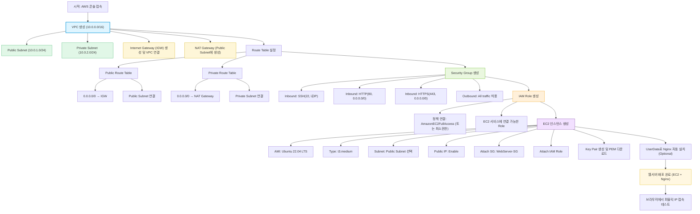

---
tags:
  - aws
  - ec2
  - vpc
  - ebs
  - eip
  - role
---
## 알아야할 핵심 개념

| 개념                              | 설명             | 특징                                            | 공식 문서 링크                                                                                                                                                                                                                                                                                                  |
| ------------------------------- | -------------- | --------------------------------------------- | --------------------------------------------------------------------------------------------------------------------------------------------------------------------------------------------------------------------------------------------------------------------------------------------------------- |
| **인스턴스 (Instance)**             | 가상 머신          | EC2에서 실행되는 서버 한 대                             | [What is Amazon EC2?](https://docs.aws.amazon.com/AWSEC2/latest/UserGuide/concepts.html) ([docs.aws.amazon.com](https://docs.aws.amazon.com/AWSEC2/latest/UserGuide/concepts.html?utm_source=chatgpt.com "What is Amazon EC2? - Amazon Elastic Compute Cloud"))                                           |
| **AMI (Amazon Machine Image)**  | 인스턴스 베이스 이미지   | 운영체제 및 프리셋 소프트웨어 포함                           | [Amazon Machine Images in Amazon EC2](https://docs.aws.amazon.com/AWSEC2/latest/UserGuide/AMIs.html) ([docs.aws.amazon.com](https://docs.aws.amazon.com/AWSEC2/latest/UserGuide/AMIs.html?utm_source=chatgpt.com "Amazon Machine Images in Amazon EC2 - AWS Documentation"))                              |
| **인스턴스 타입 (Instance Type)**     | 성능 결정          | CPU, 메모리, 네트워크 성능 설정 (예: t3.micro, m6i.large) | [Amazon EC2 instance types](https://docs.aws.amazon.com/AWSEC2/latest/UserGuide/instance-types.html) ([docs.aws.amazon.com](https://docs.aws.amazon.com/AWSEC2/latest/UserGuide/instance-types.html?utm_source=chatgpt.com "Amazon EC2 instance types - AWS Documentation"))                              |
| **VPC (Virtual Private Cloud)** | 가상 네트워크        | AWS 내에서 격리된 네트워크 환경                           | [Amazon VPC documentation](https://docs.aws.amazon.com/vpc/latest/userguide/) — (별도 링크)                                                                                                                                                                                                                   |
| **서브넷 (Subnet)**                | VPC 내 서브 네트워크  | 공개/비공개 설정 가능                                  | [Subnet documentation](https://docs.aws.amazon.com/vpc/latest/userguide/VPC_Subnets.html) — (별도 링크)                                                                                                                                                                                                       |
| **보안 그룹 (Security Group)**      | 인바운드/아웃바운드 방화벽 | 인스턴스 수준 방화벽 규칙 설정 (포트 허용)                     | [Security groups for your VPC](https://docs.aws.amazon.com/vpc/latest/userguide/VPC_SecurityGroups.html) — (별도 링크)                                                                                                                                                                                        |
| **키 페어 (Key Pair)**             | SSH 접속 키       | 개인키(.pem)는 로컬 보관, 공개키는 AWS에 등록                | [Amazon EC2 key pairs](https://docs.aws.amazon.com/AWSEC2/latest/UserGuide/ec2-key-pairs.html) — (별도 링크)                                                                                                                                                                                                  |
| **EBS (Elastic Block Store)**   | 영구 볼륨          | 인스턴스 디스크, 데이터 보존                              | [What is Amazon EBS?](https://docs.aws.amazon.com/ebs/latest/userguide/what-is-ebs.html) ([docs.aws.amazon.com](https://docs.aws.amazon.com/ebs/latest/userguide/what-is-ebs.html?utm_source=chatgpt.com "What is Amazon Elastic Block Store? - Amazon EBS"))                                             |
| **Elastic IP (EIP)**            | 고정 공인 IP       | 인스턴스 재시작해도 유지                                 | [Elastic IP Addresses](https://docs.aws.amazon.com/AWSEC2/latest/UserGuide/elastic-ip-addresses-eip.html) — (별도 링크)                                                                                                                                                                                       |
| **IAM Role for EC2**            | 권한 부여          | 인스턴스가 AWS 리소스에 접근할 때 사용                       | [IAM roles for Amazon EC2](https://docs.aws.amazon.com/AWSEC2/latest/UserGuide/iam-roles-for-amazon-ec2.html) ([docs.aws.amazon.com](https://docs.aws.amazon.com/AWSEC2/latest/UserGuide/iam-roles-for-amazon-ec2.html?utm_source=chatgpt.com "IAM roles for Amazon EC2 - Amazon Elastic Compute Cloud")) |
| **User data**                   | 초기 실행 스크립트     | 인스턴스 부팅 시 자동 실행                               | [Run commands on your Linux instance at launch](https://docs.aws.amazon.com/AWSEC2/latest/UserGuide/user-data.html) — (별도 링크)                                                                                                                                                                             |
| **Stopping vs Terminating**     | 인스턴스 상태        | Stop: 일시 중지(디스크 유지), Terminate: 삭제(데이터 손실 가능) | [Stop or terminate your instance](https://docs.aws.amazon.com/AWSEC2/latest/UserGuide/Stop_Start.html) — (별도 링크)                                                                                                                                                                                          |
| **SSM Session Manager**         | 안전한 접속 방법      | SSH 대신 콘솔에서 접속(IAM Role + SSM Agent 필요)       | [AWS Systems Manager Session Manager](https://docs.aws.amazon.com/systems-manager/latest/userguide/session-manager.html) — (별도 링크)                                                                                                                                                                        |

---
## 설계 시 고려 사항
|항목|고려사항|
|---|---|
|🌐 **VPC 구성**|하나의 프로젝트(웹 서비스)당 VPC 하나로 시작공개 서브넷: 웹 서버비공개 서브넷: DB, 내부 API|
|🚪 **보안 그룹 정책**|SSH(22)는 내 IP만, HTTP(80)/HTTPS(443)는 전체 허용(0.0.0.0/0)|
|🔑 **IAM Role**|EC2가 S3, CloudWatch 등에 접근 필요할 때만 생성 (원칙: 최소 권한)|
|💾 **EC2 인스턴스**|공인 IP 필요, 서브넷은 공개 서브넷에 배치|
|🧱 **서브넷 / 라우팅**|공개 서브넷은 Internet Gateway 경로 필요비공개 서브넷은 NAT Gateway(선택 사항)|
|🔐 **SSH Key 관리**|`.pem` 파일은 로컬 보안 저장소에만|
|💰 **비용 관리**|필요 없을 땐 중지(Stop) 또는 삭제(Terminate)|
### VPC → 서브넷 → IGW/NAT → 라우팅 → SG → IAM → EC2 구조화

| 단계  | 리소스                   | 설명                    | 비고                    |
| --- | --------------------- | --------------------- | --------------------- |
| 1   | **VPC**               | AWS 네트워크의 기본 단위       | CIDR: 10.0.0.0/16     |
| 2   | **서브넷**               | Public / Private 구분   | AZ를 분리하여 고가용성 확보 가능   |
| 3   | **IGW / NAT Gateway** | 인터넷 연결 구성             | 퍼블릭은 IGW, 프라이빗은 NAT   |
| 4   | **라우팅 테이블**           | 네트워크 트래픽 경로 설정        | IGW ↔ 퍼블릭, NAT ↔ 프라이빗 |
| 5   | **보안그룹(SG)**          | EC2 인스턴스 방화벽          | SSH는 제한, 80/443만 개방   |
| 6   | **IAM Role**          | EC2에 AWS 리소스 접근 권한 부여 | 최소 권한 원칙              |
| 7   | **EC2**               | 실제 서버 인스턴스            | 웹서버, API 서버 배포        |

