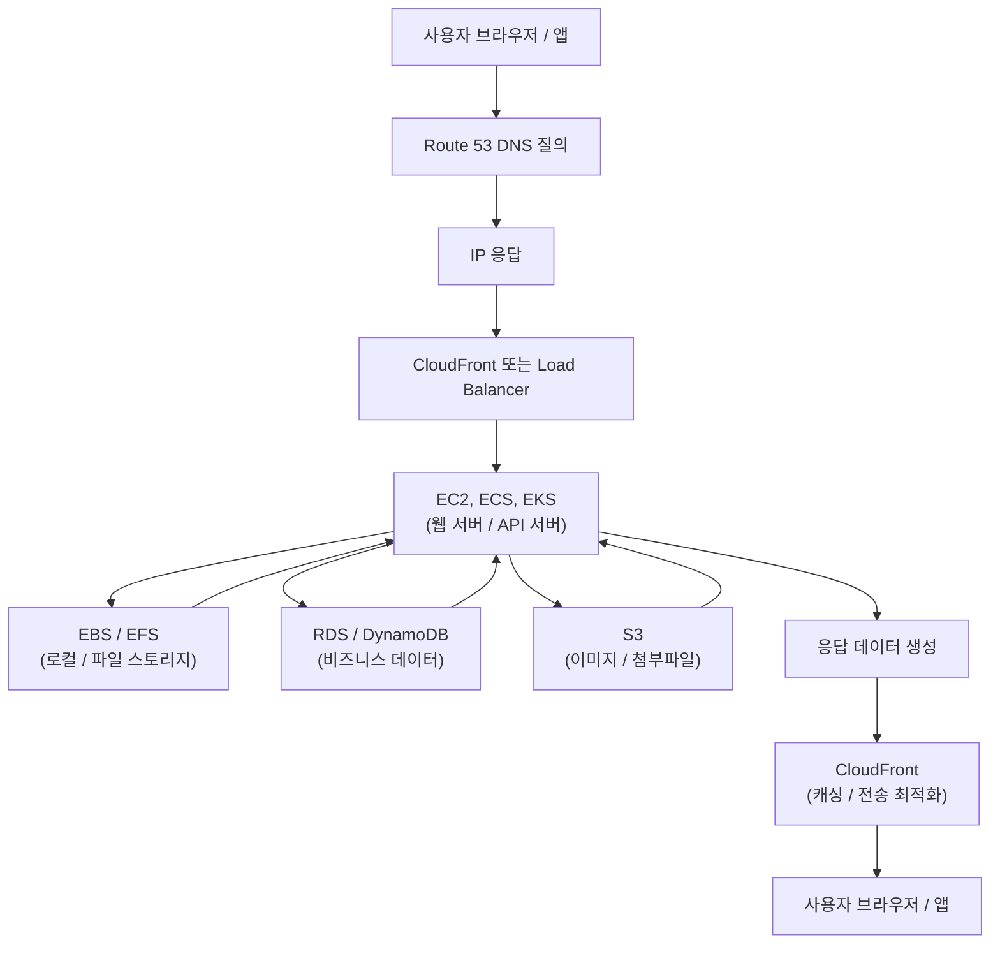

---
tags:
  - aws
---
# 1. 온프로미스와 aws 용어 비교
## AWS 핵심 서비스 매핑표

| **컨셉** | **AWS 서비스** | **설명** | **추가 정보** |
|---|---|---|---|
| **방화벽** | **Security Groups (보안 그룹)** | 인스턴스 레벨의 방화벽. 인스턴스에 들어오고 나가는 트래픽을 제어합니다.  | 상태 기반 (Stateful) 방화벽. 미리 정의된 규칙에 따라 트래픽을 허용하거나 거부합니다. |
| **방화벽** | **Network ACLs (NACL)** | 서브넷 레벨의 방화벽. 서브넷으로 들어오고 나가는 트래픽을 제어합니다. | 무상태 (Stateless) 방화벽. 모든 트래픽에 대해 규칙을 평가합니다.  보안 그룹과 함께 사용하여 다중 방어 계층을 구성할 수 있습니다. |
| **접근 제어** | **IAM (Identity and Access Management)** | AWS 리소스에 대한 접근 권한을 관리합니다. 사용자, 그룹, 역할, 정책을 통해 권한을 부여합니다. | 최소 권한 원칙 (Principle of Least Privilege)을 적용하여 보안을 강화합니다.  다단계 인증 (MFA)을 활성화하여 계정 보안을 강화합니다. |
| **로드 밸런싱** | **ELB (Elastic Load Balancing)** | 트래픽을 여러 EC2 인스턴스로 분산하여 애플리케이션의 가용성과 확장성을 높입니다. | Application Load Balancer (ALB), Network Load Balancer (NLB), Classic Load Balancer (CLB) 등 다양한 유형의 로드 밸런서를 제공합니다. |
| **네트워크** | **VPC (Virtual Private Cloud)** | AWS 클라우드 내에 격리된 네트워크 환경을 구축합니다. | CIDR 블록, 서브넷, 라우팅 테이블, 인터넷 게이트웨이 등을 사용하여 네트워크를 구성합니다.  VPC Peering을 사용하여 다른 VPC와 연결할 수 있습니다. |
| **서버** | **EC2 (Elastic Compute Cloud)** | 가상 서버를 제공합니다. 다양한 운영체제, 인스턴스 유형, 스토리지 옵션을 선택할 수 있습니다. | Auto Scaling을 사용하여 트래픽 변화에 따라 자동으로 인스턴스를 확장/축소할 수 있습니다.  Spot Instance를 사용하여 저렴한 가격으로 EC2 인스턴스를 사용할 수 있습니다. |
| **NAS (Network Attached Storage)** | **EFS (Elastic File System)** | EC2 인스턴스에서 공유할 수 있는 네트워크 파일 시스템을 제공합니다. | 여러 EC2 인스턴스에서 동시에 파일에 접근할 수 있습니다.  데이터 암호화, 백업, 복구 기능을 제공합니다. |
| **디스크** | **EBS (Elastic Block Storage)** | EC2 인스턴스에 연결할 수 있는 블록 스토리지 볼륨을 제공합니다. | 다양한 유형의 EBS 볼륨을 제공하며, 성능 및 비용 요구 사항에 따라 선택할 수 있습니다.  EBS 스냅샷을 사용하여 데이터를 백업하고 복구할 수 있습니다. |
| **컨테이너 오케스트레이션** | **EKS (Elastic Kubernetes Service)** | Kubernetes를 사용하여 컨테이너화된 애플리케이션을 배포, 관리, 확장할 수 있는 서비스입니다. | Kubernetes 클러스터 관리를 자동화하여 운영 부담을 줄여줍니다. |
| **서버리스 컨테이너** | **Fargate** | 서버 또는 컨테이너 인스턴스를 프로비저닝하거나 관리할 필요 없이 컨테이너를 실행할 수 있는 서비스입니다.  | EKS 또는 ECS와 함께 사용하여 서버리스 컨테이너 환경을 구축할 수 있습니다. |
| **객체 스토리지** | **S3 (Simple Storage Service)** | 확장성, 가용성, 보안성이 뛰어난 객체 스토리지를 제공합니다. | 이미지, 비디오, 문서 등 다양한 유형의 데이터를 저장할 수 있습니다.  정적 웹사이트 호스팅, 데이터 백업, 빅데이터 분석 등 다양한 용도로 사용될 수 있습니다. |
| **관계형 데이터베이스** | **RDS (Relational Database Service)** | MySQL, PostgreSQL, Oracle, SQL Server, MariaDB 등 다양한 관계형 데이터베이스 엔진을 제공합니다. | 데이터베이스 관리 작업을 자동화하여 운영 부담을 줄여줍니다. |
| **NoSQL 데이터베이스** | **DynamoDB** | 확장성, 성능, 유연성이 뛰어난 NoSQL 데이터베이스입니다. | 대규모 데이터 처리, 실시간 애플리케이션, 모바일 애플리케이션 등 다양한 용도로 사용될 수 있습니다. |

![[aws_핵심인프라서비스.png]]
# 2. AWS 기본 구성
## 사용자가 서비스를 사용할 때 순서


# 3. 온프로미스, 클라우드, 하이브리드
## IT 인프라 배포 모델 비교

| 특징 | 온프로미스 (On-Premise) | 하이브리드 (Hybrid) | 클라우드 (Cloud) | 멀티 클라우드 (Multi-Cloud) |
|---|---|---|---|---|
| **정의** | 기업 자체 데이터 센터 내에 모든 IT 인프라를 구축하고 관리하는 방식 | 자체 데이터 센터와 클라우드 환경을 혼합하여 사용하는 방식 | IT 인프라를 클라우드 서비스 제공업체(AWS, Azure, Google Cloud 등)에 완전히 위탁하는 방식 | 둘 이상의 클라우드 서비스 제공업체를 동시에 사용하는 방식 |
| **소유 및 관리** | 기업이 모든 하드웨어, 소프트웨어, 네트워크를 소유하고 직접 관리 | 기업이 일부 인프라를 소유하고 관리하며, 나머지는 클라우드에 위탁 | 클라우드 서비스 제공업체가 모든 인프라를 소유하고 관리 | 각 클라우드 제공업체가 특정 서비스 또는 워크로드를 담당 |
| **비용** | 초기 투자 비용 높음, 유지보수 비용 지속적 발생 | 초기 투자 비용과 유지보수 비용 모두 발생, 클라우드 사용량에 따라 비용 변동 | 초기 투자 비용 없음, 사용량 기반 과금 방식 | 각 클라우드 서비스 비용 발생, 관리 복잡성 증가 |
| **확장성** | 확장 및 축소에 시간과 비용이 많이 소요 | 필요에 따라 클라우드 리소스를 유연하게 확장/축소 가능 | 확장성이 매우 높음, 필요에 따라 즉시 리소스 추가 가능 | 각 클라우드 제공업체의 확장성을 활용 |
| **보안** | 기업이 직접 보안 정책을 수립하고 관리 | 보안 정책을 분리하거나 통합하여 관리 가능 | 클라우드 제공업체의 보안 시스템 활용, 추가적인 보안 조치 필요 | 각 클라우드 제공업체의 보안 시스템 활용, 통합적인 보안 관리 필요 |
| **제어** | IT 인프라에 대한 완전한 제어 | 제어 수준을 조정 가능 | 제어 수준이 제한적 | 각 클라우드 제공업체에 대한 제어 수준이 제한적 |
| **장점** | 데이터 보안 및 제어 수준 높음, 규정 준수 용이 | 유연성 및 확장성 확보, 비용 효율성 향상 | 초기 투자 비용 절감, 관리 부담 감소, 높은 확장성 | 특정 공급업체 종속성 감소, 서비스 가용성 향상 |
| **단점** | 초기 투자 비용 높음, 관리 부담 큼, 확장성 제한적 | 복잡한 관리, 보안 위험 증가 가능성 | 데이터 보안 및 제어 수준 제한적, 공급업체 종속성 | 관리 복잡성 증가, 통합 및 관리 어려움 |
| **적합한 경우** | 높은 보안 및 규정 준수 요구 사항, 엄격한 데이터 제어 요구 사항 | 유연성과 확장성을 동시에 요구하는 경우, 특정 워크로드를 온프레미스로 유지해야 하는 경우 | 초기 투자 비용을 줄이고자 하는 경우, 관리 부담을 줄이고자 하는 경우 | 특정 서비스에 대한 최적의 성능을 위해 여러 클라우드 제공업체를 사용해야 하는 경우 |

## 초기 실무 ec2나 eks 세팅 및 운영 순서
```ad-info
EC2는 VM(서버) 관점에서 네트워크·보안·이미지·모니터링·백업·비용 관리를 먼저 설계하고, EKS는 클러스터(컨트롤 플레인·노드), 네트워킹(CNI), IAM(권한), 보안(네임스페이스·Pod 보안), 관찰성(로그/메트릭), 자동화(IaC/CI/CD)를 차근차근 구성해야 합니다. ([docs.aws.amazon.com](https://docs.aws.amazon.com/AWSEC2/latest/UserGuide/EC2_GetStarted.html?utm_source=chatgpt.com "Get started with Amazon EC2 - Amazon Elastic Compute Cloud"))
```


---

# 공통(모든 시작 전에) — 준비 & 핵심 개념 (순서 0)

1. **AWS 계정, 조직(Organizations)·결제 설정 확인** — 루트 계정은 잠그고 MFA 설정. (보안의 기본) ([docs.aws.amazon.com](https://docs.aws.amazon.com/IAM/latest/UserGuide/best-practices.html?utm_source=chatgpt.com "Security best practices in IAM - AWS Identity and Access ..."))
    
2. **IAM 원칙: 최소권한(Least Privilege)** — 사용자/역할은 필요한 권한만 부여. 관리자는 별도 계정. ([docs.aws.amazon.com](https://docs.aws.amazon.com/IAM/latest/UserGuide/best-practices.html?utm_source=chatgpt.com "Security best practices in IAM - AWS Identity and Access ..."))
    
3. **리전·AZ 전략 결정** — 가용성(멀티-AZ) vs 비용. 프로덕션은 다중 AZ 권장. ([d1.awsstatic.com](https://d1.awsstatic.com/whitepapers/aws-operational-checklists.33b7d4821d7084789a88225313207d725aa9c6e2.pdf?utm_source=chatgpt.com "Operational Checklists for AWS - awsstatic.com"))
    
4. **인프라 코드(IaC) 선택** — Terraform / AWS CloudFormation / CDK 중 하나로 모든 리소스 정의(재현성/감사). 권장: 처음부터 IaC로. ([d1.awsstatic.com](https://d1.awsstatic.com/whitepapers/aws-operational-checklists.33b7d4821d7084789a88225313207d725aa9c6e2.pdf?utm_source=chatgpt.com "Operational Checklists for AWS - awsstatic.com"))
    
---

# PART A — EC2 실무 세팅 체크리스트 (순서대로)

### 1) 네트워크 설계 (VPC)

- VPC, 서브넷(공개/사설), 라우팅 테이블, IGW/NAT 게이트웨이, 보안 그룹/네트워크 ACL 설계.
    
    - 공개 서브넷: 로드밸런서/퍼블릭 리소스.
        
    - 사설 서브넷: EC2 앱/DB(인터넷 직접 접속 차단).
        
- 권장: 멀티-AZ에 서브넷 분리. ([d1.awsstatic.com](https://d1.awsstatic.com/whitepapers/aws-operational-checklists.33b7d4821d7084789a88225313207d725aa9c6e2.pdf?utm_source=chatgpt.com "Operational Checklists for AWS - awsstatic.com"))
    

### 2) 키/인증·접속 방식

- SSH 키페어 관리(비공개 안전 보관), 가능하면 **SSM Session Manager(SSH 대신)** 사용 — 인바운드 SSH 차단 가능. ([docs.aws.amazon.com](https://docs.aws.amazon.com/AWSEC2/latest/UserGuide/ec2-best-practices.html?utm_source=chatgpt.com "Best practices for Amazon EC2"))
    

### 3) AMI·인스턴스 선택 및 구성

- 공식 베이스 AMI 선택(예: Amazon Linux 2, Ubuntu LTS).
    
- AMI 빌드 자동화(예: Packer + userdata 또는 Image Builder) — 보안 패치·에이전트 사전 설치. ([docs.aws.amazon.com](https://docs.aws.amazon.com/AWSEC2/latest/UserGuide/ec2-best-practices.html?utm_source=chatgpt.com "Best practices for Amazon EC2"))
    

### 4) 인스턴스 유형 & 스토리지

- CPU/메모리 프로파일에 맞는 인스턴스 타입 선택(테스트→프로파일링→오토스케일).
    
- EBS 타입( gp3 / io2 등 )과 백업(스냅샷) 정책 설계. 중요한 데이터는 EFS/S3 사용 고려. ([docs.aws.amazon.com](https://docs.aws.amazon.com/AWSEC2/latest/UserGuide/ec2-best-practices.html?utm_source=chatgpt.com "Best practices for Amazon EC2"))
    

### 5) 보안(보안 그룹, OS 하드닝)

- 보안 그룹 최소화(필요 포트만 열기), NACL은 보조 수단.
    
- OS 레벨: 불필요 서비스 제거, 패치 자동화, SELinux/방화벽 정책, 로그 포워딩(CloudWatch/ELK). ([sysdig.com](https://www.sysdig.com/blog/26-aws-security-best-practices?utm_source=chatgpt.com "26 AWS security best practices to adopt in production"))
    

### 6) 모니터링·로깅

- CloudWatch로 메트릭(CPU, Memory custom), 로그(CW Logs) 설정. 알람/대시보드 생성.
    
- 필요시 외부 APM(데이타독,뉴렐릭) 연동. ([qovery.com](https://www.qovery.com/blog/aws-production-deployment-checklist?utm_source=chatgpt.com "2023 Checklist for Production Deployment on AWS"))
    

### 7) 자동화·스케일링

- Autoscaling Group(ASG) 설정(간단한 헬스체크, 최소/최대 인스턴스), AMI 기반 롤링 업데이트.
    
- 로드밸런서(ALB/NLB)와 연동. ([docs.aws.amazon.com](https://docs.aws.amazon.com/AWSEC2/latest/UserGuide/ec2-best-practices.html?utm_source=chatgpt.com "Best practices for Amazon EC2"))
    

### 8) 백업·DR

- EBS 스냅샷, AMI 백업, 데이터베이스는 RDS 스냅샷/백업. 장애 시 복구(RTO/RPO) 목표 정의. ([d1.awsstatic.com](https://d1.awsstatic.com/whitepapers/aws-operational-checklists.33b7d4821d7084789a88225313207d725aa9c6e2.pdf?utm_source=chatgpt.com "Operational Checklists for AWS - awsstatic.com"))
    

### 9) 비용관리

- 적절한 인스턴스 리저브/스팟/온디맨드 전략, CloudWatch 예산 알람, 태그 기준(cost-center·env). ([docs.aws.amazon.com](https://docs.aws.amazon.com/AWSEC2/latest/UserGuide/ec2-best-practices.html?utm_source=chatgpt.com "Best practices for Amazon EC2"))
    

---

# PART B — EKS(쿠버네티스) 실무 세팅 체크리스트 (순서대로)

> 요약: EKS는 제어계층은 AWS가 관리하지만, **클러스터 구성·노드·네트워크·IAM·보안·관찰성**을 잘 설계해야 안전하고 운영 가능한 클러스터가 됩니다. ([docs.aws.amazon.com](https://docs.aws.amazon.com/eks/latest/best-practices/introduction.html?utm_source=chatgpt.com "Amazon EKS Best Practices Guide"))

### 1) 클러스터 설계(아키텍처 결정)

- **클러스터 경계**: 단일 클러스터로 얼마나 많은 워크로드 운영? 멀티-테넌시(네임스페이스隔離) vs 멀티-클러스터(안전/규모).
    
- AWS 리전/멀티-AZ 배포 — 노드를 여러 AZ에 분산. ([Caylent](https://caylent.com/blog/production-grade-eks-clusters-best-practices-for-scalability-security-and-efficiency?utm_source=chatgpt.com "Production-Grade EKS Clusters: Best Practices for ..."))
    

### 2) 네트워킹(CNI) 선정 및 서브넷

- AWS VPC CNI(amazon-vpc-cni-k8s) 기본, 필요시 Calico 등 네트워크 정책 지원 도입.
    
- 서브넷: 퍼블릭/프라이빗 분리, 서비스형 로드밸런서(ALB/NLB) 연동 고려. ([docs.aws.amazon.com](https://docs.aws.amazon.com/eks/latest/best-practices/introduction.html?utm_source=chatgpt.com "Amazon EKS Best Practices Guide"))
    

### 3) 인증·권한(IAM) 구성

- **IRSA(IAM Roles for Service Accounts)** 사용해 Pod별로 AWS 권한 최소화.
    
- 관리자는 AWS IAM + Kubernetes RBAC을 결합해 권한 통제. ([Medium](https://yashthaker.medium.com/eks-best-practices-a-practical-guide-from-the-trenches-98f825523aac?utm_source=chatgpt.com "EKS Best Practices: A Practical Guide from the Trenches"))
    

### 4) 클러스터 생성 방법(권장)

- IaC로 EKS 생성: eksctl, Terraform, AWS CDK 중 선택. 프로덕션은 Terraform/CloudFormation 권장.
    
- 관리형 노드 그룹(Managed Node Groups) 또는 Karpenter/自建 ASG로 오토스케일링 설계. ([docs.aws.amazon.com](https://docs.aws.amazon.com/eks/latest/best-practices/introduction.html?utm_source=chatgpt.com "Amazon EKS Best Practices Guide"))
    

### 5) 보안 강화

- 네임스페이스 분리, Pod Security Policies(또는 Pod Security Admission), 네트워크 폴리시 적용.
    
- EKS 보안 베스트프랙티스(이미지 스캔, CIS 벤치마크 준수, secrets 관리: AWS Secrets Manager / SSM Parameter Store / HashiCorp Vault). ([docs.aws.amazon.com](https://docs.aws.amazon.com/eks/latest/userguide/security-best-practices.html?utm_source=chatgpt.com "Secure Amazon EKS clusters with best practices"))
    

### 6) 로깅·모니터링·트레이싱

- 로그: Fluentd/Fluent Bit → CloudWatch/ELK/S3.
    
- 메트릭: Prometheus + Grafana (또는 CloudWatch Container Insights).
    
- 분산 트레이싱: Jaeger/X-Ray 연동 권장. ([docs.aws.amazon.com](https://docs.aws.amazon.com/eks/latest/best-practices/introduction.html?utm_source=chatgpt.com "Amazon EKS Best Practices Guide"))
    

### 7) CI/CD 파이프라인

- 이미지 빌드(컨테이너 레지스트리: ECR), 이미지 서명/스캔, GitOps(ArgoCD/Flux) 또는 CI 도구(Jenkins/GitHub Actions)로 배포 자동화.
    
- 배포 전략: Canary / Blue-Green / Rolling. ([Caylent](https://caylent.com/blog/production-grade-eks-clusters-best-practices-for-scalability-security-and-efficiency?utm_source=chatgpt.com "Production-Grade EKS Clusters: Best Practices for ..."))
    

### 8) 수명주기 관리(업그레이드/백업)

- EKS 버전 업그레이드 정책, 노드 그룹 롤링 업그레이드 테스트.
    
- 등화(백업): etcd 기반 백업(예: Velero) 및 애플리케이션 데이터 백업 설계. ([docs.aws.amazon.com](https://docs.aws.amazon.com/eks/latest/best-practices/introduction.html?utm_source=chatgpt.com "Amazon EKS Best Practices Guide"))
    

### 9) 비용 최적화

- 노드 사이즈·스팟 인스턴스 사용, Karpenter로 빈티지 최적화, 리소스 요청/한도(Resource Requests/Limits) 정책 적용. ([Caylent](https://caylent.com/blog/production-grade-eks-clusters-best-practices-for-scalability-security-and-efficiency?utm_source=chatgpt.com "Production-Grade EKS Clusters: Best Practices for ..."))
    

---

# PART C — 실무로 바로 적용할 수 있는 시작 명령(초기 빠른 예시)

(아래는 예시; 실제로는 IaC로 정의하세요.)

1. AWS CLI 로그인 및 프로필 설정
    

```bash
aws configure --profile prod
```

2. eksctl로 기본 EKS 클러스터 생성(예시)
    

```bash
eksctl create cluster \
  --name prod-cluster \
  --region ap-northeast-2 \
  --nodegroup-name standard-workers \
  --node-type t3.medium \
  --nodes 3 \
  --nodes-min 2 \
  --nodes-max 6 \
  --managed
```

(프로덕션은 VPC/서브넷/IAM 정책을 미리 IaC로 정의해야 함). ([qovery.com](https://www.qovery.com/blog/deploy-eks-cluster-in-10-minute?utm_source=chatgpt.com "Deploy a Production-Ready EKS Cluster in 10 Minutes"))

3. EC2 인스턴스 시작(예시, CLI)
    

```bash
aws ec2 run-instances --image-id ami-xxxx --instance-type t3.large --key-name mykey --subnet-id subnet-xxx --security-group-ids sg-xxx
```

---

# PART D — 운영·보안 체크 (최우선 점검 항목)

- 루트 계정 잠금 + MFA. ([docs.aws.amazon.com](https://docs.aws.amazon.com/IAM/latest/UserGuide/best-practices.html?utm_source=chatgpt.com "Security best practices in IAM - AWS Identity and Access ..."))
    
- 모니터링(CloudWatch Alarm) 및 비용 알람 설정. ([qovery.com](https://www.qovery.com/blog/aws-production-deployment-checklist?utm_source=chatgpt.com "2023 Checklist for Production Deployment on AWS"))
    
- 정기 패치·취약점 스캔(이미지 스캔). ([sysdig.com](https://www.sysdig.com/blog/26-aws-security-best-practices?utm_source=chatgpt.com "26 AWS security best practices to adopt in production"))
    
- 접근 로그·감사(CloudTrail) 활성화. (컴플라이언스/포렌식) ([d1.awsstatic.com](https://d1.awsstatic.com/whitepapers/aws-operational-checklists.33b7d4821d7084789a88225313207d725aa9c6e2.pdf?utm_source=chatgpt.com "Operational Checklists for AWS - awsstatic.com"))
    

---

# 참고 문서(읽어볼 우선순위)

1. EC2 Best Practices — AWS 공식 가이드. ([docs.aws.amazon.com](https://docs.aws.amazon.com/AWSEC2/latest/UserGuide/ec2-best-practices.html?utm_source=chatgpt.com "Best practices for Amazon EC2"))
    
2. EKS Best Practices Guide — AWS 공식(및 GitHub 가이드). ([docs.aws.amazon.com](https://docs.aws.amazon.com/eks/latest/best-practices/introduction.html?utm_source=chatgpt.com "Amazon EKS Best Practices Guide"))
    
3. EKS 보안 베스트 프랙티스(공식). ([docs.aws.amazon.com](https://docs.aws.amazon.com/eks/latest/userguide/security-best-practices.html?utm_source=chatgpt.com "Secure Amazon EKS clusters with best practices"))
    
4. IAM 보안 베스트 프랙티스. ([docs.aws.amazon.com](https://docs.aws.amazon.com/IAM/latest/UserGuide/best-practices.html?utm_source=chatgpt.com "Security best practices in IAM - AWS Identity and Access ..."))
    
5. 운영 체크리스트(whitepaper). ([d1.awsstatic.com](https://d1.awsstatic.com/whitepapers/aws-operational-checklists.33b7d4821d7084789a88225313207d725aa9c6e2.pdf?utm_source=chatgpt.com "Operational Checklists for AWS - awsstatic.com"))
    

---

원하시면 다음을 **바로 만들어 드립니다** (선택하세요 — 한 가지만 골라 주세요):

1. EC2용 **IaC(Terraform) 템플릿**(VPC, Subnet, Security Group, EC2 + Autoscaling)
    
2. EKS용 **eksctl + Terraform 조합 예제**(IRSA, Managed Node Group, VPC 설정 포함)
    
3. 프로덕션용 **보안 체크리스트(점검표, CSV/엑셀)** — 감사용으로 바로 사용 가능
    
4. 위 내용을 Mermaid 다이어그램(영역: 인터넷 / DMZ / 내부망)으로 시각화
    

원하시는 옵션 번호 하나 골라주세요 — 바로 만들어 드릴게요. 🚀