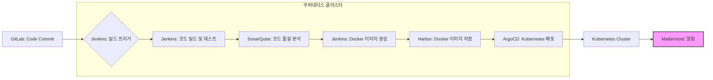

---
tags:
  - CI/CD
  - Jenkins
---

## Jenkins 완벽 정리: 개념, 특징, 실무 활용

```ad-info
Jenkins는 오픈 소스 자동화 서버로, 지속적인 통합(CI) 및 지속적인 전달(CD) 파이프라인을 구축하고 자동화하는 데 사용됩니다. 개발 프로세스를 간소화하고, 소프트웨어 품질을 향상시키며, 배포 속도를 높이는 데 핵심적인 역할을 합니다.
```


### 1. Jenkins란 무엇인가?

| 항목           | 설명                                                       |
| ------------ | -------------------------------------------------------- |
| **정의**       | 오픈 소스 자동화 서버                                             |
| **주요 기능**    | 빌드 자동화, 테스트 자동화, 배포 자동화, 지속적인 통합/지속적인 전달(CI/CD) 파이프라인 구축 |
| **핵심 특징**    | 확장성, 유연성, 활발한 커뮤니티, 풍부한 플러그인 생태계                         |
| **프로그래밍 언어** | Java                                                     |
| **라이선스**     | MIT License (오픈 소스)                                      |

### 2. Jenkins의 주요 구성 요소

| 구성 요소 | 설명 |
|---|---|
| **Jenkins Master** | Jenkins 서버의 중앙 관리자. 빌드 작업 스케줄링, 플러그인 관리, 결과 집계 등 핵심 기능을 수행합니다. |
| **Jenkins Agent (Slave)** | 실제 빌드, 테스트, 배포 작업을 수행하는 노드. Master 노드의 부담을 분산시키고 병렬 처리 능력을 향상시킵니다. |
| **Job (Project)** | 자동화할 작업을 정의하는 단위. 소스 코드 빌드, 테스트 실행, 배포 스크립트 실행 등을 포함합니다. |
| **Pipeline** | Job을 연결하여 전체 CI/CD 파이프라인을 정의하는 방식. 코드 변경부터 배포까지의 전체 흐름을 시각적으로 표현하고 관리할 수 있습니다. |
| **Plugin** | Jenkins의 기능을 확장하는 추가 모듈. 다양한 버전 관리 시스템, 빌드 도구, 테스트 프레임워크, 배포 플랫폼과 통합할 수 있습니다. |

### 3. Jenkins의 실무 활용 예시

| 활용 분야 | 설명 |
|---|---|
| **코드 통합 및 빌드 자동화** | 개발자들이 코드를 저장소에 커밋할 때마다 자동으로 코드를 빌드하고, 컴파일 오류를 검사합니다. |
| **자동 테스트 실행** | 코드 빌드 후 자동으로 단위 테스트, 통합 테스트, 기능 테스트 등을 실행하여 코드 품질을 유지합니다. |
| **정적 코드 분석** | SonarQube와 같은 도구를 사용하여 코드 품질을 분석하고, 잠재적인 버그나 보안 취약점을 검사합니다. |
| **Docker 이미지 빌드 및 배포** | Dockerfile을 기반으로 Docker 이미지를 빌드하고, Docker Hub 또는 사설 레지스트리에 저장합니다. Kubernetes와 함께 사용하여 컨테이너 기반 애플리케이션을 배포합니다. |
| **클라우드 인프라 자동화** | Terraform, Ansible과 같은 도구를 사용하여 클라우드 인프라를 프로비저닝하고 관리합니다. |
| **알림 및 보고서 생성** | 빌드 결과, 테스트 결과, 배포 결과 등을 이메일, Slack, Microsoft Teams 등으로 알림을 보내고, 보고서를 생성합니다. |

**실무 예시:**

1.  **개발자가 코드 커밋:** 개발자가 Git 저장소에 코드를 커밋합니다.
2.  **Jenkins 빌드 트리거:** Git 저장소의 변경 사항을 감지한 Jenkins가 자동으로 빌드 작업을 시작합니다.
3.  **코드 빌드 및 테스트:** Jenkins는 코드를 빌드하고, 단위 테스트, 통합 테스트 등을 실행합니다.
4.  **Docker 이미지 생성:** 테스트가 성공하면 Jenkins는 Docker 이미지를 빌드하고 Docker Hub에 푸시합니다.
5.  **Kubernetes 배포:** Jenkins는 Kubernetes 클러스터에 Docker 이미지를 배포합니다.
6.  **알림:** 빌드, 테스트, 배포 결과가 Slack 채널로 전송됩니다.


```mermaid
graph LR
    A[GitLab: Code Commit] --> B{Jenkins: 빌드 트리거}
    B --> C[Jenkins: 코드 빌드 및 테스트}
    C --> D[Jenkins: Docker 이미지 생성]
    D --> E[Harbor: Docker 이미지 저장]
    E --> F[Jenkins: Kubernetes 배포 (직접)]
    F --> G[Mattermost: 알림]

    subgraph 도커 인스턴스
        B
        C
        D
        E
        F
    end

    style G fill:#f9f,stroke:#333,stroke-width:2px
```





### 4. Jenkins 장점 및 단점

| 장점 | 단점 |
|---|---|
| **유연성 및 확장성:** 다양한 플러그인을 통해 기능 확장 가능 | **초기 설정 복잡성:** Jenkins 설정 및 관리에 대한 이해 필요 |
| **오픈 소스:** 무료로 사용 가능하며, 커뮤니티 지원 활발 | **UI/UX:** 현대적인 CI/CD 도구에 비해 UI/UX가 다소 떨어짐 |
| **활발한 커뮤니티:** 문제 발생 시 커뮤니티 지원을 통해 해결 가능 | **보안:** 보안 취약점에 대한 지속적인 관리 필요 |
| **다양한 플러그인:** 다양한 도구 및 시스템과 통합 가능 | **리소스:** 빌드 에이전트 운영을 위한 리소스 필요 |

### 5. Jenkins 관련 도구

*   **Jenkins Pipeline:** Jenkins에서 CI/CD 파이프라인을 정의하고 관리하는 도구.
*   **Ansible:** 구성 관리 및 자동화 도구.
*   **Docker:** 컨테이너 기반 애플리케이션 개발 및 배포 도구.
*   **Kubernetes:** 컨테이너 오케스트레이션 플랫폼.
*   **SonarQube:** 코드 품질 분석 도구.
*   **Terraform:** 인프라 자동화 도구.

Jenkins는 여전히 많은 기업에서 사용하는 강력한 CI/CD 도구입니다.  다양한 플러그인과 유연성을 통해 복잡한 CI/CD 파이프라인을 구축하고 자동화할 수 있습니다.  최신 CI/CD 도구와 비교하여 단점도 존재하지만, 숙련된 개발자에게는 여전히 유용한 도구입니다.