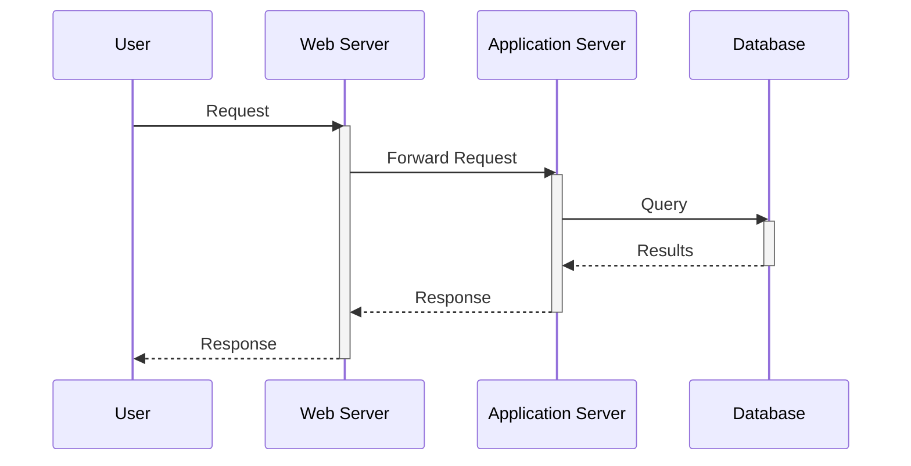
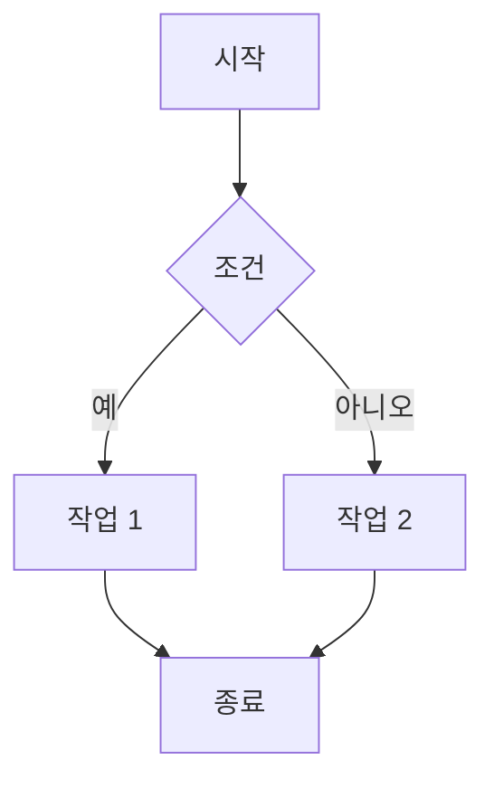
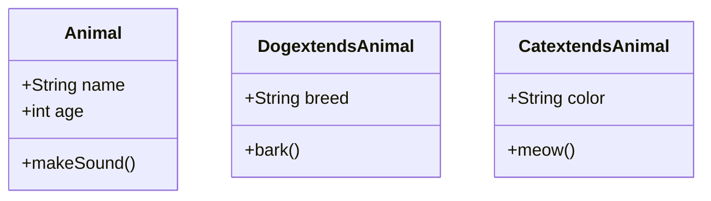
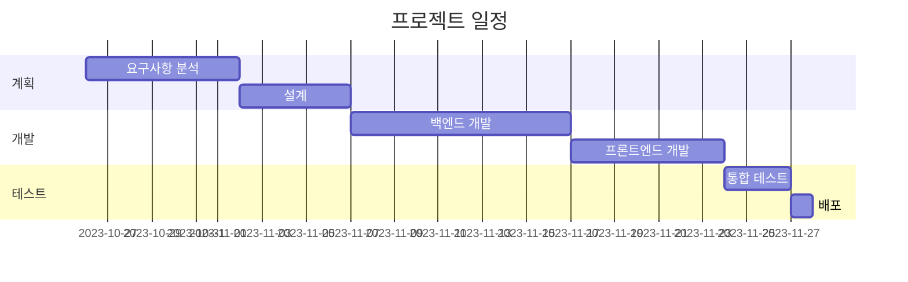

---
tags:
  - git
  - markdown
  - 형상관리
---

> 마크다운은 텍스트 기반의 경량 마크업 언어입니다. 텍스트 파일만으로 서식이 적용된 문서를 작성할 수 있으며, HTML로 쉽게 변환할 수 있습니다.

  

## **1 기본 문법**

  

*   **제목:** `#` 개수를 사용하여 제목 크기를 지정합니다.

    *   `# 제목 1`

    *   `## 제목 2`

    *   `### 제목 3`

*   **강조:**

    *   `*기울임꼴*` 또는 `_기울임꼴_`

    *   `**굵게**` 또는 `__굵게__`

*   **목록:**

    *   **순서 없는 목록:**

        *   `- 목록 항목`

        *   `* 목록 항목`

        *   `+ 목록 항목`

    *   **순서 있는 목록:**

        *   `1. 목록 항목`

        *   `2. 목록 항목`

*   **링크:** `[링크 텍스트](URL)`

*   **이미지:** ``

*   **코드:**

    *   **인라인 코드:** `` `코드` ``

    *   **코드 블록:**

  

    ```

    코드

    ```

  

*   **인용:** `> 인용문`

*   **수평선:** `---` 또는 `***`

*   **테이블:**

  

    | 헤더 1 | 헤더 2 |

    |---|---|

    | 내용 1 | 내용 2 |

    | 내용 3 | 내용 4 |

  

## **2 마크다운 활용**

  

*   **README 파일 작성:** 프로젝트 설명, 설치 방법, 사용법 등을 마크다운으로 작성합니다.

*   **문서 작성:** 기술 문서, 블로그 글, 메모 등을 마크다운으로 작성합니다.

*   **웹 페이지 작성:** 마크다운 편집기를 사용하여 웹 페이지를 작성하고 HTML로 변환합니다.

  

## **3 마크다운 편집기 및 변환기**

  

*   **Visual Studio Code:** 마크다운 미리보기 기능을 제공하는 강력한 코드 편집기입니다.

*   **Typora:** 마크다운 편집기로, 실시간 미리보기 기능을 제공합니다.

*   **Pandoc:** 다양한 형식으로 문서를 변환할 수 있는 명령줄 도구입니다.

*   **StackEdit:** 웹 기반 마크다운 편집기로, GitHub, Dropbox 등과 연동할 수 있습니다.

  

이 가이드라인을 통해 Git과 마크다운의 기본 개념과 사용법을 익히고, 프로젝트 관리 및 문서 작성에 활용할 수 있기를 바랍니다.

## Mermaid 사용 예시 및 실무 적용 상황

Mermaid는 텍스트 기반의 다이어그램 작성 도구로, 코드를 사용하여 다이어그램을 생성하고 편집할 수 있습니다. Markdown 파일이나 Git 저장소 등 어디든 쉽게 삽입할 수 있어 협업에도 용이합니다.

### 1. 시퀀스 다이어그램 (Sequence Diagram)

*   **Mermaid 코드:**



*   **실무 상황:**  API 호출 흐름, 사용자 인증 과정, 결제 시스템 등 시스템 내부의 상호 작용을 시각적으로 표현할 때 유용합니다. 마이크로서비스 아키텍처에서 서비스 간의 통신 흐름을 이해하는 데 특히 도움이 됩니다.

### **2. 플로우차트 (Flowchart)**

*   **Mermaid 코드:**



*   **실무 상황:**  업무 프로세스, 알고리즘, 의사 결정 흐름 등을 시각적으로 표현할 때 사용합니다. 예를 들어, 새로운 기능 개발 프로세스, 버그 수정 프로세스, 사용자 온보딩 프로세스 등을 플로우차트를 사용하여 정의하고 공유할 수 있습니다.

### 3. 클래스 다이어그램 (Class Diagram)

*   **Mermaid 코드:**



*   **실무 상황:**  객체 지향 프로그래밍에서 클래스, 인터페이스, 상속 관계 등을 시각적으로 표현할 때 사용합니다. 시스템 설계 단계에서 클래스 구조를 정의하고 공유하는 데 유용하며, 코드 리뷰 시 코드 구조를 이해하는 데 도움이 됩니다.

### 4. 간트 차트 (Gantt Chart)

*   **Mermaid 코드:**



*   **실무 상황:**  프로젝트 일정 관리, 작업 분배, 진행 상황 추적 등에 사용합니다. 작업 간의 의존성을 시각적으로 표현하여 프로젝트 관리자가 일정을 효과적으로 관리하고 리소스를 배분하는 데 도움이 됩니다.

**실무 활용 팁:**

*   **Git 저장소에 Mermaid 파일 저장:** `.mermaid` 확장자를 사용하여 Mermaid 코드를 Git 저장소에 저장하고, Markdown 파일에서 이미지로 삽입합니다.
*   **CI/CD 파이프라인 연동:** CI/CD 파이프라인에서 Mermaid 코드를 이미지로 변환하여 문서 생성 자동화합니다.
*   **Markdown 편집기 지원:** VS Code, Typora 등 Mermaid를 지원하는 Markdown 편집기를 사용하면 실시간으로 다이어그램을 미리 볼 수 있습니다.

**Mermaid 관련 자료:**

*   **Mermaid 공식 웹사이트:** [https://mermaid.js.org/](https://mermaid.js.org/)
*   **Mermaid Live Editor:** [https://mermaid.live/](https://mermaid.live/)
*   **Mermaid Documentation:** [https://mermaid-js.github.io/mermaid/#/](https://mermaid-js.github.io/mermaid/#/)

Mermaid는 배우기 쉽고 강력한 다이어그램 작성 도구입니다. 팀 협업 시 의사소통을 개선하고 문서 품질을 향상시키는 데 도움