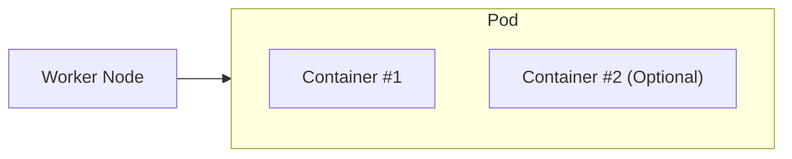
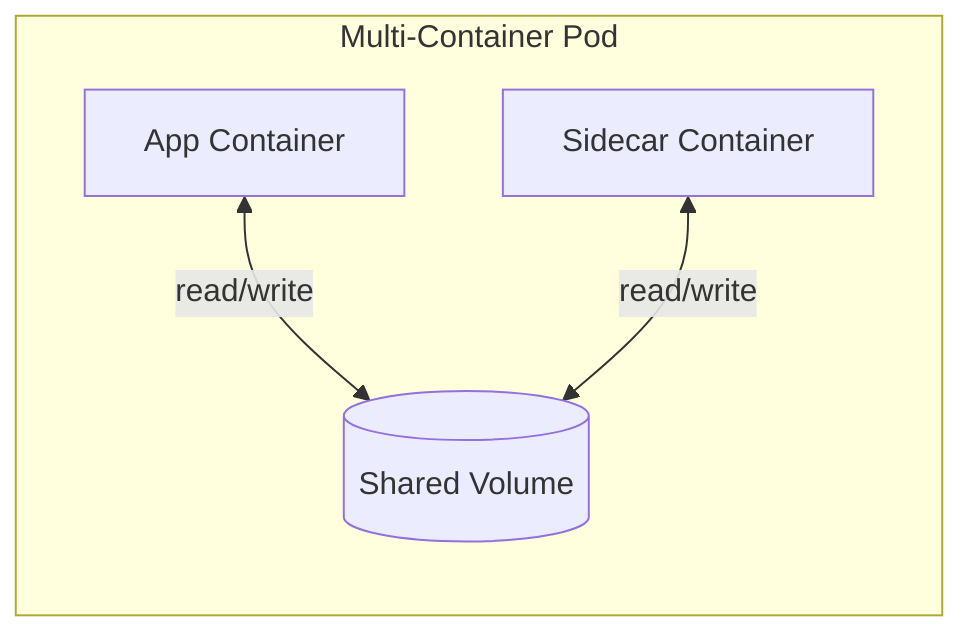
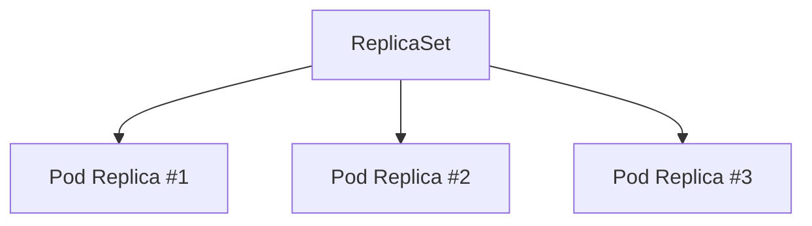
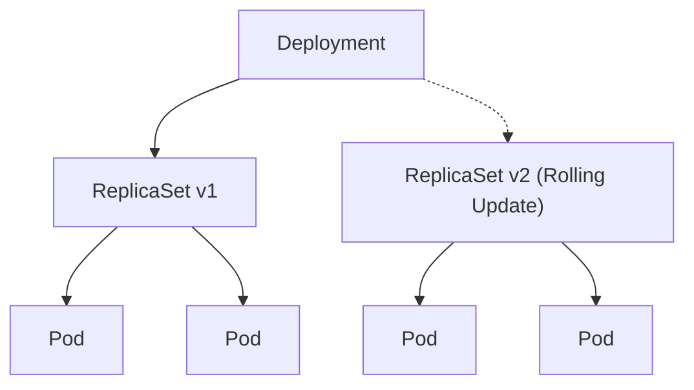
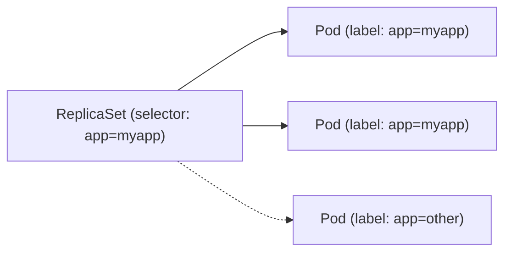
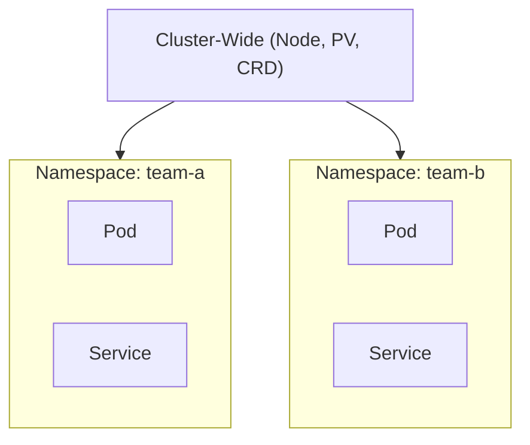
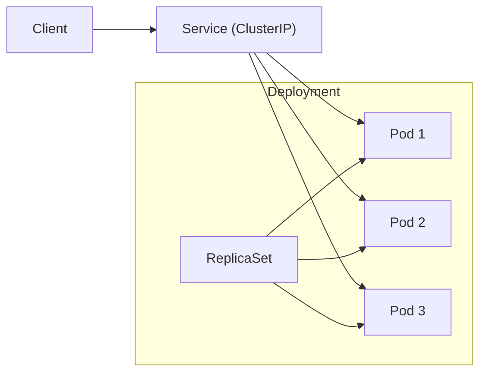

# 1️⃣ Pod (기본 단위)

Pod는 쿠버네티스에서 배포 가능한 가장 작은 단위이며,  
하나 이상의 컨테이너를 포함할 수 있다.

---

## ✔ Pod 아키텍처 (Mermaid)



---

## ✔ 단일 컨테이너 Pod 예시 YAML

```yaml
apiVersion: v1
kind: Pod
metadata:
  name: myapp-pod
  labels:
    app: myapp
    type: front-end
spec:
  containers:
    - name: nginx-container
      image: nginx:1.18
```

---

# 2️⃣ Multi-container Pod

한 Pod 안에 여러 컨테이너가 공존하며, **하나의 네트워크 네임스페이스 공유**

- localhost 공유
    
- 볼륨 공유 가능
    
- 대표 패턴: Sidecar, Adapter, Ambassador
    

---

## ✔ Multi-container Pod 아키텍처 (Mermaid)



---

## ✔ Multi-container Pod YAML 예시

```yaml
apiVersion: v1
kind: Pod
metadata:
  name: multi-container-pod
spec:
  containers:
    - name: app
      image: nginx
      volumeMounts:
        - name: shared-data
          mountPath: /usr/share/nginx/html
    - name: sidecar
      image: busybox
      command: ['sh', '-c', 'echo sidecar-data > /shared/data; sleep 3600']
      volumeMounts:
        - name: shared-data
          mountPath: /shared
  volumes:
    - name: shared-data
      emptyDir: {}
```

---

# 3️⃣ ReplicaSet (RS)

ReplicaSet은 **지정된 수의 Pod 복제본을 항상 유지**한다.

---

## ✔ ReplicaSet 아키텍처 (Mermaid)



---

## ✔ ReplicaSet YAML 예시

```yaml
apiVersion: apps/v1
kind: ReplicaSet
metadata:
  name: myapp-rs
spec:
  replicas: 3
  selector:
    matchLabels:
      app: myapp
  template:
    metadata:
      labels:
        app: myapp
    spec:
      containers:
        - name: nginx
          image: nginx:1.18
```

---

# 4️⃣ Deployment

Deployment는 **ReplicaSet을 관리**하고,  
롤링 업데이트 / 롤백 기능을 제공한다.

---

## ✔ Deployment 아키텍처 (Mermaid)



---

## ✔ Deployment YAML 예시

```yaml
apiVersion: apps/v1
kind: Deployment
metadata:
  name: myapp-deploy
spec:
  replicas: 3
  selector:
    matchLabels:
      app: myapp
  template:
    metadata:
      labels:
        app: myapp
    spec:
      containers:
        - name: nginx
          image: nginx:1.18
```

---

# 5️⃣ Labels & Selectors

- Label: 객체(Pod 등)에 붙이는 key:value 태그
    
- Selector: Label 기반 필터링 (ReplicaSet, Deployment, Services에서 사용)
    

---

## ✔ Label / Selector 구조 (Mermaid)



---

# 6️⃣ Namespace

리소스를 논리적으로 분리하는 단위

- default
    
- kube-system
    
- kube-public
    
- custom namespace 생성 가능
    

---

## ✔ Namespace 아키텍처 (Mermaid)



---

## ✔ Namespace 생성 YAML

```yaml
apiVersion: v1
kind: Namespace
metadata:
  name: team-a
```

---

# 7️⃣ 예시: Deployment + Service 전체 구조



---

# 📦 전체 요약

|개념|설명|
|---|---|
|**Pod**|배포 최소 단위|
|**Multi-container Pod**|Sidecar 패턴 등 가능|
|**ReplicaSet**|Pod 개수 보장|
|**Deployment**|RS 관리 + 롤링 업데이트|
|**Labels/Selectors**|리소스 연결/필터 기준|
|**Namespace**|리소스 논리적 구분|

---