# 1️⃣ Kubernetes 전체 아키텍처

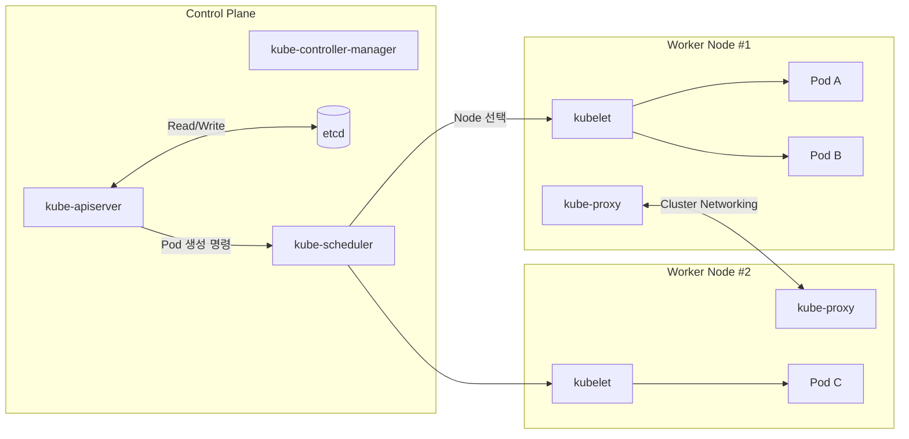

---

# 2️⃣ ETCD (Key-Value Store)

Kubernetes의 모든 상태가 저장되는 중앙 저장소.

### 저장되는 정보 예:

- Pod / Deployment / ReplicaSet
    
- Node 정보
    
- ConfigMap, Secret
    
- RBAC 정보
    

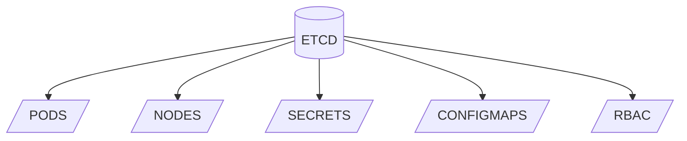

---

# 3️⃣ kube-apiserver 흐름

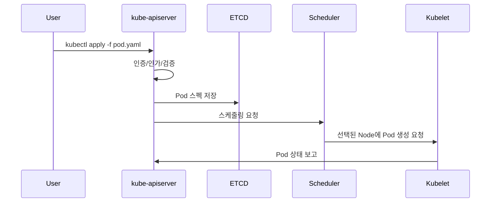

---

# 4️⃣ Controller Manager 동작 구조

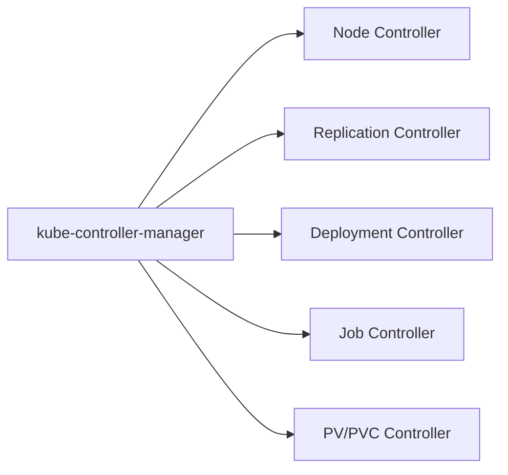

컨트롤러는 “Desired State(원하는 상태)” 를 유지하는 역할.

---

# 5️⃣ Scheduler 동작 구조

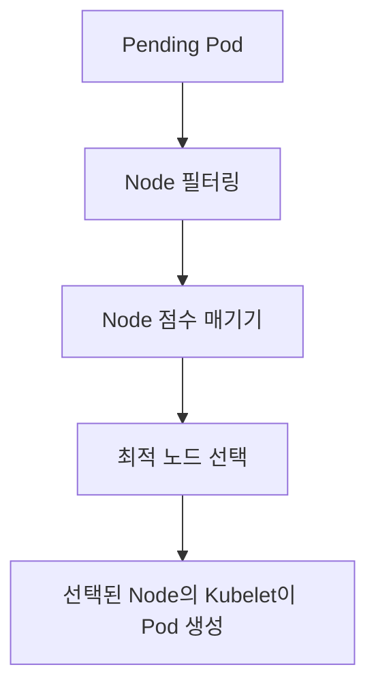

---

# 6️⃣ Kubelet 구조

```mermaid
flowchart TD
    APIServer[kube-apiserver] --> Kubelet
    Kubelet --> CRI[Container Runtime (containerd)]
    CRI --> Pod1[Pod 실행]
    Kubelet --> Monitor[컨테이너 상태 모니터링]
    Monitor --> APIServer
```

---

# 7️⃣ Kube-proxy / Service 구조도

쿠버네티스는 Pod가 바뀌어도 Service IP(ClusterIP)가 고정되어 안정적인 서비스 연결을 보장한다.

---

## 🔹 Service 타입별 구조

### (1) ClusterIP

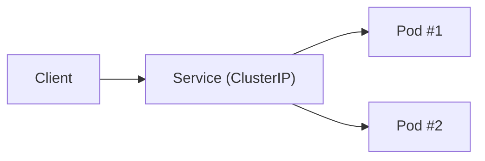

---

### (2) NodePort

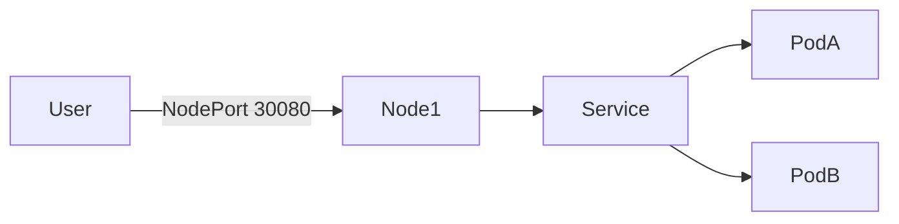

---

### (3) LoadBalancer

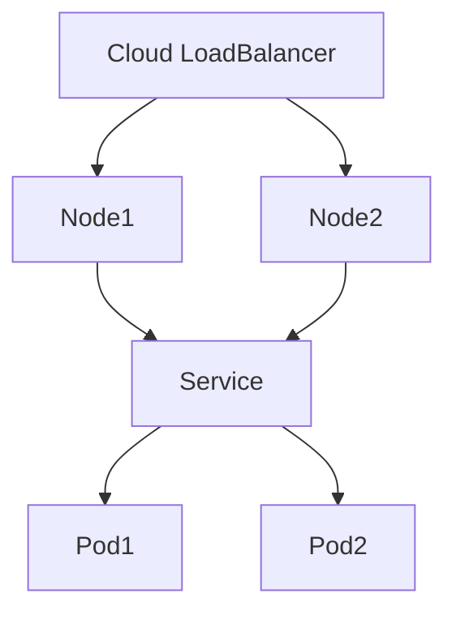

---

### (4) ExternalName

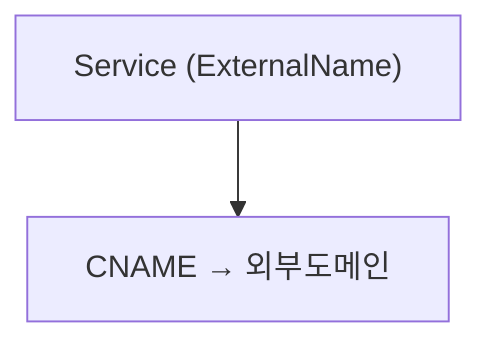

---

# 8️⃣ Service → Pod 트래픽 흐름 (kube-proxy iptables/ipvs)

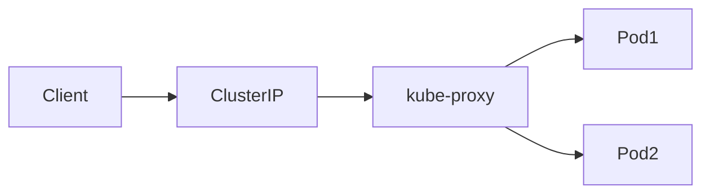

---

# 9️⃣ 전체 네트워크 구조 종합

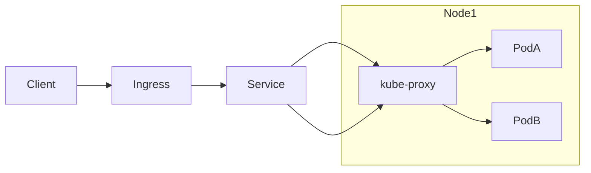

---

# 🔟 요약

|구성 요소|역할|
|---|---|
|**etcd**|모든 클러스터 상태 저장|
|**kube-apiserver**|중앙 API, 모든 요청 관문|
|**scheduler**|Pod 실행할 Node 선택|
|**controller-manager**|Desired State 유지|
|**kubelet**|Node에서 Pod 실행 관리|
|**kube-proxy**|서비스 네트워크 구성|
|**Service**|Pod 그룹을 안정적으로 노출|
|**ClusterIP**|내부 통신용 기본 서비스|
|**NodePort**|외부에서 Node IP로 접근|
|**LoadBalancer**|클라우드 L4/L7 사용|
|**ExternalName**|DNS CNAME 방식|

---

