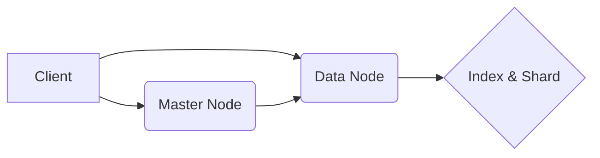
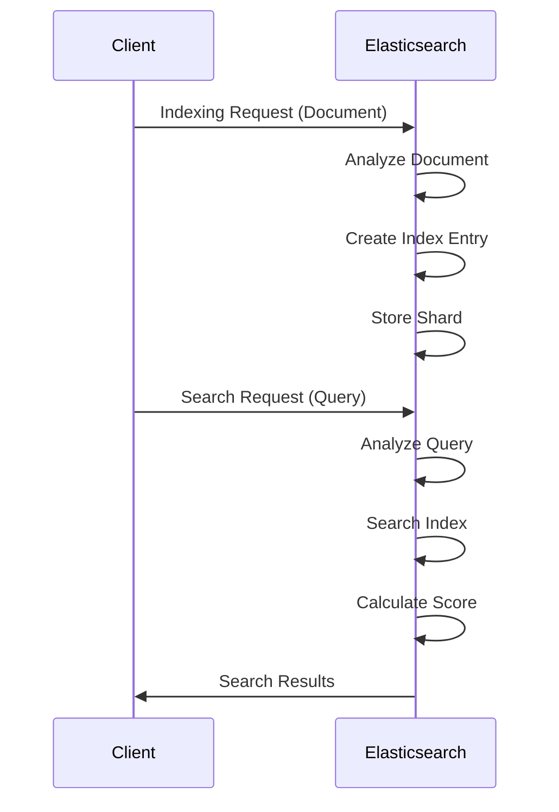

---
tags:
  - logging
  - 로깅
  - elasticsearch
---
## Elasticsearch: 심층 분석 및 작동 원리 (Mermaid 연결형식 포함)

Elasticsearch는 강력하고 분산된 검색 및 분석 엔진입니다. 단순한 검색을 넘어, 대규모 데이터를 실시간으로 처리하고 분석하여 다양한 인사이트를 제공하는 데 사용됩니다. 이 문서는 Elasticsearch의 핵심 개념, 아키텍처, 작동 방식에 대한 심층적인 설명을 제공합니다.

### 1. 핵심 개념

*   **Document:** Elasticsearch는 데이터를 'Document' 단위로 저장합니다. Document는 JSON 형식으로 구성되며, 다양한 필드(field)를 포함할 수 있습니다.
*   **Index:** Index는 유사한 Document들의 모음입니다. 마치 관계형 데이터베이스의 '테이블'과 유사하게 생각할 수 있습니다.
*   **Type (Elasticsearch 7.x 이하):** Index 내에서 Document의 '구조'를 정의합니다. Elasticsearch 7.x 버전에서는 Type 개념이 제거되었습니다.
*   **Shard:** Index를 수평으로 분할한 조각입니다. Shard를 통해 데이터를 여러 노드에 분산 저장하여 확장성과 고가용성을 확보합니다.
*   **Replica:** Shard의 복제본입니다. Replica를 통해 데이터의 가용성을 높이고, 검색 성능을 향상시킬 수 있습니다.

---

### 2. Elasticsearch 아키텍처

Elasticsearch는 클러스터 기반 아키텍처를 사용합니다. 클러스터는 하나 이상의 노드로 구성됩니다. 각 노드는 Elasticsearch 프로세스를 실행하며, 데이터를 저장하고 검색하는 역할을 수행합니다.

*   **Master Node:** 클러스터의 상태를 관리하고, Shard의 할당을 담당합니다. 클러스터에는 여러 Master Node가 있을 수 있지만, 하나의 Master Node만이 클러스터를 관리합니다.
*   **Data Node:** 데이터를 저장하고, 검색 요청을 처리합니다. Data Node는 CPU, 메모리, 디스크 I/O 성능이 중요합니다.
*   **Client Node:** 검색 요청을 Data Node에 전달하고, 결과를 반환합니다. Client Node는 검색 요청을 처리하는 데 특화되어 있습니다.
*   **Coordinating Node:** 클러스터 내의 다른 노드와 통신하여 검색 요청을 처리하고 결과를 통합합니다.

---

### 3. Elasticsearch 작동 방식

Elasticsearch의 작동 방식은 다음과 같은 단계로 이루어집니다.

1.  **Indexing (데이터 저장):**
    *   Document가 Elasticsearch에 전송되면, 분석 과정을 거쳐 용어(term)로 분리됩니다.
    *   분석된 용어는 인덱스에 저장됩니다. 인덱스는 용어와 해당 용어가 포함된 Document의 위치를 매핑하는 자료구조입니다.
    *   Document는 Shard에 분산 저장됩니다. Shard는 여러 노드에 분산될 수 있습니다.

2.  **Searching (데이터 검색):**
    *   검색 요청이 Elasticsearch에 전송되면, 분석 과정을 거쳐 검색 용어로 분리됩니다.
    *   Elasticsearch는 인덱스를 검색하여 검색 용어를 포함하는 Document를 찾습니다.
    *   찾은 Document는 관련성 점수(score)와 함께 반환됩니다.
    *   Elasticsearch는 관련성 점수를 기준으로 Document를 정렬하여 검색 결과로 반환합니다.

3.  **Data Analysis (데이터 분석):**
    *   Elasticsearch는 Aggregation 기능을 통해 데이터를 집계하고 분석할 수 있습니다.
    *   Aggregation은 데이터를 그룹화하고, 통계 값을 계산하는 데 사용됩니다.
    *   Elasticsearch는 다양한 Aggregation 유형을 제공합니다. (예: Count, Sum, Average, Min, Max)

---

### 4. 주요 기능 및 특징

*   **Full-Text Search:** 텍스트 데이터에 대한 강력한 검색 기능 제공
*   **Schema-Free:** 데이터 구조를 미리 정의할 필요 없음 (JSON 기반)
*   **RESTful API:** HTTP 기반의 RESTful API를 통해 데이터 접근 및 관리
*   **Real-Time Search & Analysis:** 실시간으로 데이터 검색 및 분석 가능
*   **Scalability & High Availability:** 분산 아키텍처를 통해 확장성 및 고가용성 확보
*   **Geo-Spatial Data Support:** 지리 공간 데이터에 대한 검색 및 분석 지원
*   **Aggregation Framework:** 데이터 집계 및 분석을 위한 강력한 프레임워크 제공

---

### 5. Elasticsearch 활용 분야

*   **로그 분석:** 서버, 애플리케이션, 네트워크 장비 등의 로그 분석
*   **애플리케이션 성능 모니터링 (APM):** 애플리케이션 성능 모니터링 및 문제 해결
*   **보안 정보 및 이벤트 관리 (SIEM):** 보안 이벤트 분석 및 위협 탐지
*   **전자상거래 검색:** 상품 검색 및 추천
*   **비즈니스 분석:** 데이터 분석 및 시각화
*   **맞춤형 검색:** 특정 요구 사항에 맞는 검색 엔진 구축

Elasticsearch는 다양한 분야에서 활용될 수 있는 강력하고 유연한 검색 및 분석 엔진입니다. 이 문서를 통해 Elasticsearch의 핵심 개념, 아키텍처, 작동 방식에 대한 이해를 높이고, 이를 바탕으로 Elasticsearch를 효과적으로 활용할 수 있기를 바랍니다.