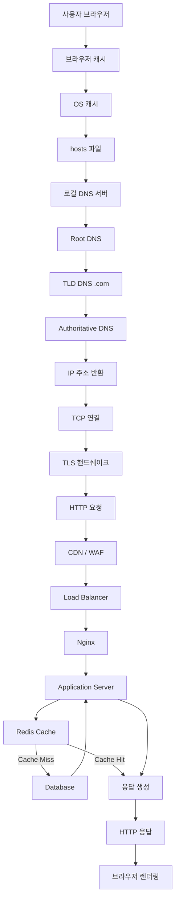

웹 흐름을 “사용자가 브라우저에 도메인을 입력한 순간부터 화면이 뜰 때까지” 기준으로 **현업 DevOps/인프라 관점에서 풀어서 단계별로** 설명해줄게.
(면접에서도 그대로 써먹을 수 있는 수준으로 정리)

---

# 🌐 1. 사용자가 URL 입력

예:

```
https://example.com
```

여기서 브라우저는 먼저 URL을 분해함:

* 프로토콜: HTTPS
* 도메인: example.com
* 포트: 기본 443

---

# 🌍 2. DNS 조회 (Domain → IP 변환)

브라우저는 “example.com의 IP 뭐야?”를 알아야 함

## 우선순위

1. 브라우저 캐시
2. OS 캐시
3. hosts 파일
4. DNS 서버 요청

---

## DNS 흐름

```
사용자 → 로컬 DNS → Root DNS → TLD DNS → Authoritative DNS
```

* Root: `.`
* TLD: `.com`
* Authoritative: 실제 도메인 관리 서버

👉 최종 결과:

```
example.com → 93.184.216.34
```

---

# 🚀 3. TCP 연결 (3-way handshake)

IP를 알았으면 서버랑 연결 시작

```
Client → SYN →
Server → SYN-ACK →
Client → ACK →
```

👉 연결 성립

---

# 🔐 4. TLS Handshake (HTTPS일 경우)

HTTPS라면 여기서 암호화 설정

과정:

1. 클라이언트 → 지원 암호 목록 전달
2. 서버 → 인증서 전달
3. 클라이언트 → 인증서 검증 (CA 기반)
4. 대칭키 생성

👉 이후 통신은 **암호화됨**

---

# 📤 5. HTTP 요청 전송

브라우저가 요청 보냄

```
GET / HTTP/1.1
Host: example.com
User-Agent: Chrome
Cookie: ...
```

---

# 🧭 6. 서버 도착 (여기부터 인프라 핵심)

요청은 보통 이런 구조를 탐:

```
[사용자]
   ↓
[CDN / WAF]
   ↓
[Load Balancer]
   ↓
[Web Server (Nginx)]
   ↓
[Application Server]
   ↓
[DB / Cache]
```

---

## 6-1. CDN / WAF

* CDN: 캐시된 콘텐츠 제공 (CloudFront 등)
* WAF: 공격 필터링 (SQL Injection 등)

👉 DevOps 핵심: 여기서 트래픽 많이 줄임

---

## 6-2. Load Balancer

트래픽 분산

예:

* AWS ALB
* Nginx
* HAProxy

```
요청 → 서버 A / B / C 중 하나로 전달
```

---

## 6-3. Web Server (예: Nginx)

역할:

* 정적 파일 처리 (html, css, js)
* 리버스 프록시

```
location / {
  proxy_pass http://backend;
}
```

---

## 6-4. Application Server

여기서 실제 비즈니스 로직 수행

예:

* Spring Boot
* Node.js
* Django

처리:

* 로그인 체크
* 데이터 조회
* API 응답 생성

---

## 6-5. DB / Cache

* DB: MySQL, PostgreSQL
* Cache: Redis

예:

```
SELECT * FROM users WHERE id=1;
```

👉 성능 핵심:

* 캐시 먼저 조회 (Redis)
* 없으면 DB 조회

---

# 📥 7. 응답 반환

서버 → 클라이언트로 응답

```
HTTP/1.1 200 OK
Content-Type: text/html

<html>...</html>
```

---

# 🎨 8. 브라우저 렌더링

브라우저가 화면 그림

## 과정

1. HTML 파싱 → DOM 생성
2. CSS 파싱 → CSSOM 생성
3. DOM + CSSOM → Render Tree
4. Layout (위치 계산)
5. Paint (그리기)

---

## JS 실행

* JS가 DOM 수정 가능
* API 추가 요청 발생 가능 (AJAX / fetch)

---

# 🔁 9. 추가 리소스 요청

HTML 안에 포함된 것들:

```
<script src="app.js">
<link href="style.css">

```

👉 각각 다시 HTTP 요청 발생

---

# ⚡ 전체 흐름 한 줄 요약

```
URL 입력
→ DNS 조회
→ TCP 연결
→ TLS 핸드쉐이크
→ HTTP 요청
→ CDN/WAF
→ Load Balancer
→ Web Server
→ App Server
→ DB/Cache
→ 응답
→ 브라우저 렌더링
```




좋은 질문이다 👍
이 흐름을 **역할(포지션) 기준으로 나누면 실무 이해 + 면접 + 커리어 방향까지 한 번에 정리됨**

아래는 아까 웹 흐름을 기준으로 **프론트 / 백엔드 / 인프라 / DevOps**가 어디서 무엇을 하는지 정확히 끊어서 설명한 거야.

---

# 🧭 전체 흐름 기준 역할 분리

```text
사용자 → DNS → 네트워크 → CDN/WAF → LB → Web → App → Cache/DB → 응답 → 렌더링
```

---

# 🎨 1. 프론트엔드 (Frontend)

👉 담당 영역: **브라우저 이후 ~ 사용자 화면까지**

## 하는 일

### 1) 브라우저 렌더링

* HTML → DOM 생성
* CSS → 스타일 적용
* JS 실행

### 2) API 호출

```javascript
fetch("/api/user")
```

### 3) 상태 관리

* 로그인 상태
* UI 상태
* 데이터 캐싱 (React Query 등)

### 4) 성능 최적화

* Lazy Loading
* 코드 스플리팅
* 이미지 최적화

---

## 📍 흐름 위치

```text
[브라우저 렌더링]
[JS 실행]
[추가 API 요청]
```

---

## 💡 핵심 책임

* 사용자 경험 (UX)
* 화면 성능
* API 소비

---

# ⚙️ 2. 백엔드 (Backend)

👉 담당 영역: **Application Server ~ DB까지**

## 하는 일

### 1) API 서버 개발

```http
GET /api/user
```

### 2) 비즈니스 로직

* 로그인 처리
* 권한 체크
* 데이터 가공

### 3) DB 처리

```sql
SELECT * FROM users;
```

### 4) 캐시 활용

* Redis 조회
* 캐시 전략 설계

---

## 📍 흐름 위치

```text
[Application Server]
[Cache]
[Database]
```

---

## 💡 핵심 책임

* 데이터 처리
* 비즈니스 로직
* API 설계

---

# 🏗️ 3. 인프라 (Infra / System Engineer)

👉 담당 영역: **서버, 네트워크, 하드웨어 기반**

## 하는 일

### 1) 서버 구성

* 물리 서버 / VM
* OS 설치

### 2) 네트워크

* IP, 라우팅
* 방화벽 설정

### 3) DNS 관리

* 도메인 연결
* 네임서버 설정

### 4) 스토리지

* 디스크
* 백업

---

## 📍 흐름 위치

```text
[DNS]
[TCP 연결]
[네트워크]
[서버 환경]
```

---

## 💡 핵심 책임

* 시스템 안정성
* 네트워크
* 하드웨어

---

# 🚀 4. DevOps / SRE

👉 담당 영역: **전체 흐름 최적화 + 자동화 + 운영**

(요즘 핵심 포지션)

---

## 하는 일

### 1) 배포 자동화 (CI/CD)

* Git → 빌드 → 배포

예:

* Jenkins
* GitLab CI

---

### 2) 컨테이너 / 오케스트레이션

* Docker
* Kubernetes

---

### 3) 트래픽 처리

* Load Balancer
* Auto Scaling

---

### 4) 관측 (Observability)

* Prometheus
* Grafana
* 로그 수집

---

### 5) 성능 최적화

* CDN 적용
* 캐싱 전략
* DB 튜닝

---

### 6) 장애 대응

* 서버 다운 대응
* 롤백
* 장애 분석

---

## 📍 흐름 위치

```text
[CDN/WAF]
[Load Balancer]
[Web Server]
[전체 모니터링]
[배포]
```

---

## 💡 핵심 책임

* 자동화
* 확장성
* 안정성

---

# 🧩 한눈에 정리

| 구간         | 담당     |
| ---------- | ------ |
| 브라우저 렌더링   | 프론트    |
| API 요청     | 프론트    |
| API 처리     | 백엔드    |
| DB / 캐시    | 백엔드    |
| DNS / 네트워크 | 인프라    |
| LB / CDN   | DevOps |
| 배포         | DevOps |
| 모니터링       | DevOps |

---

# 🔥 현실적인 경계 (중요)

실무에서는 이렇게 겹침 👇

## DevOps vs 인프라

* 인프라 → “서버 깔고 네트워크 구성”
* DevOps → “그걸 자동화 + 운영 + 확장”

---

## DevOps vs 백엔드

* 백엔드 → API 개발
* DevOps → API가 잘 돌아가게 환경 구성

---

## 프론트 vs 백엔드

* 프론트 → UI + API 사용
* 백엔드 → API 제공

